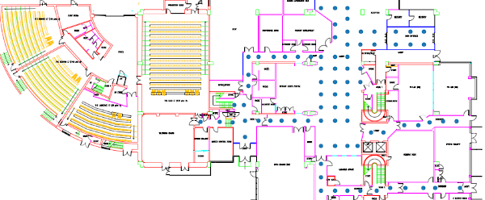
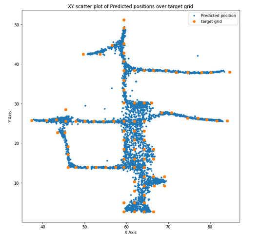
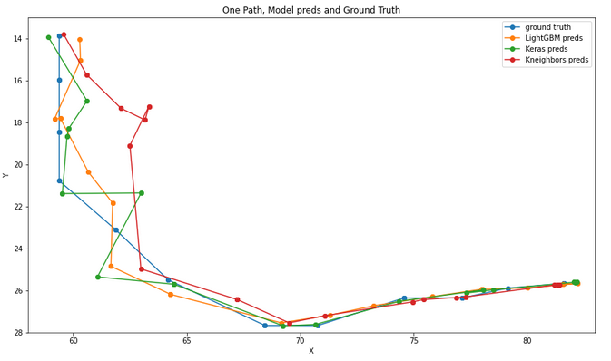

# Sustainable Indoor Location  
 

  

**ground floor map with labelling points**  

   

Current repository contains all experimentation code of the
**"Citizen participation: crowd-sensed sustainable indoor location services"** research paper. A preprint can be download from [Arxiv](https://arxiv.org/pdf/2310.16496.pdf).  

   

For outdoor location, GPS or similar systems most of the time works relative well.  
For indoor location cases, where GPS is not available, surrounding WiFis can pinpoint our location.  
WiFis are present most of the times and detecting them (finding name and signal strength) is free.
With no extra cost for equipment and no new infrastructure needed, we can create a system to accurately find our location.

  

#### Answers to  questions   
To build a system, able to find user's location in a building there are some rising questions that need to be answered:  
1. **How much data do we need?**  
Experimenting with less available samples (=paths) [LightGBM](nbs/forPdata423_numPaths_LightGBM_wifis_position.ipynb), [Keras](nbs/forPdata423_numPaths_keras_wifis_position_v2.ipynb), [Knn](nbs/forPdata423_numPaths_KNeighbors_wifis_position.ipynb)  
2. **How many different BSSIDs should be present?**  
Experimenting with less available BSSIDs [LightGBM](nbs/forPdata423_numBSSIDS_LightGBM_wifis_position.ipynb), [Keras](nbs/forPdata423_numBSSIDS_keras_wifis_position_v2.ipynb), [Knn](nbs/forPdata423_numBSSIDS_KNeighbors_wifis_position.ipynb)  
3. **How thick our labeling grid should be?**  
Experimenting with half of our original grid - double grid point mean distance [LightGBM](nbs/forPdata423_halfgrid_LightGBM_wifis_position.ipynb), [Keras](nbs/forPdata423_halfgrid_keras_wifis_position_v2.ipynb), [Knn](nbs/forPdata423_halfgrid_KNeighbors_wifis_position.ipynb)  
4. **What happens in case of missing WiFis after training?**  
Experimenting with missing BSSIDs for inference [LightGBM](nbs/forPdata423_BSSIDSresilience_LightGBM_wifis_position.ipynb), [Keras](nbs/forPdata423_BSSIDSresilience_keras_wifis_position_v2.ipynb), [Knn](nbs/forPdata423_BSSIDSresilience_KNeighbors_wifis_position.ipynb) 

  

#### Dataset  
Our dataset comes from one single floor of one building in a UK University. It consists of 423 paths with an average of 34 checkpoints per path. Our checkpoint grid is very dense, around 2.5 meters. Data collected with a custom android application. Android version used is 10 or 11 which allowed a special option for more frequent WiFi scans (every 6 seconds) whether older versions allowed only 4 scans every 2 minutes. Also note that all paths are located outside rooms, in halls and hallways.  

  

#### Modelling - Results  
Given a set of files, with each file being a single path inside the building we compose our training dataset and build our machine learning models.  

  

Model Performance (5 fold cv) summarized. (Error is euclidean distance, in meters)  

| Model | Error  |
| :-     | :- |
| LightGbm         | 1.95 |
| Simple LSTM Keras| 2.08 |
| Nearest Neighbors| 2.40 |

  
Plot below shows out of fold (oof) predictions using blue dots and target ground truth using bigger yellow dots.  
It is remarkable to notice that model's outcome follows building's structure with halls and hallways.   

  

Plot of a single path, all model predictions and real path.   

  

